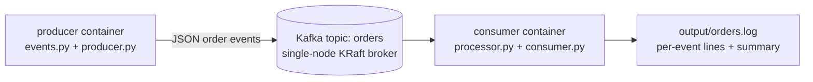

# Kafka Event Pipeline

A small producer-consumer pipeline: a **producer** generates mock order events and
publishes them to a Kafka topic; a **consumer** reads them, keeps a running
per-product summary, and writes each processed event plus the final summary to a
log file.

## What it does

- `producer/producer.py` generates a random order event (`producer/events.py`:
  product, quantity, price, computed amount, order id, timestamp) and publishes it
  as JSON to the Kafka topic `orders`, once per `EVENT_INTERVAL_SECONDS`.
- `consumer/consumer.py` subscribes to `orders` as consumer group `order-consumer`,
  and for every message calls `consumer/processor.py` to update a running total
  (orders count, total amount, per-product breakdown), printing and appending a
  line to `output/orders.log`. Amounts are tracked in integer cents to avoid
  floating-point rounding. When it stops (see `EXPECTED_EVENTS` below), it appends
  a final summary section to the same file.
- Because both write to the same Kafka topic/partition, and a consumer group in
  Kafka processes a partition's messages in the order they were produced, the
  consumer processes events in the order the producer sent them — the running
  totals in the log reflect that order.

## Architecture



Kafka runs as a single-node broker in **KRaft mode** (`bitnami/kafka` image), so no
separate ZooKeeper container is needed. All three containers (kafka, producer,
consumer) are started with Docker Compose.

## Project structure

```
producer/                events.py (event generation), producer.py, Dockerfile
consumer/                processor.py (stats logic), consumer.py, Dockerfile
docker-compose.yml        kafka + producer + consumer
tests/                     12 unit tests (Python unittest) — no Kafka needed
scripts/check_output.sh    verifies the consumer's output file after a run
.githooks/pre-push         runs the tests before a push
.github/workflows/ci-cd.yml   GitHub Actions pipeline
output/                    orders.log is written here (mounted into the consumer container)
```

## Run it locally

Requires Docker with Docker Compose v2.

```bash
git clone https://github.com/<your-username>/kafka-event-pipeline.git
cd kafka-event-pipeline
docker compose up -d --build
```

This starts Kafka, then the producer (publishing one event a second forever) and
the consumer (running forever, appending to `output/orders.log`). Watch it live:

```bash
docker compose logs -f consumer
tail -f output/orders.log
```

Stop everything with `docker compose down`.

### Run a fixed batch instead (useful for a demo or for testing)

```bash
NUM_EVENTS=20 EVENT_INTERVAL_SECONDS=0.2 EXPECTED_EVENTS=20 docker compose up --build
```

The producer sends exactly 20 events and exits; the consumer exits once it has
processed 20 events and writes the summary. Then check the result:

```bash
scripts/check_output.sh output/orders.log 20
```

## Run the tests

```bash
pip install -r producer/requirements.txt
python -m unittest discover -s tests -v
```

12 tests, none of which need a running Kafka broker:
- `tests/test_events.py` (5 tests): every generated event has the expected fields,
  `amount_cents` is `price_cents * quantity`, quantity is in the valid range, the
  product is from the known catalog, and generated order ids are unique.
- `tests/test_processor.py` (7 tests): totals and the per-product breakdown update
  correctly as events are processed, the running total in each log line is correct,
  events update state in arrival order, and the summary formatting is correct
  (including for an empty state).

## CI/CD (GitHub Actions)

`.github/workflows/ci-cd.yml` runs on every push and pull request to `main`:

1. **test**: installs dependencies and runs the 12 unit tests.
2. **pipeline-smoke-test** (only if `test` passed): builds the images, starts Kafka
   on the runner and waits for its health check, starts the consumer, runs the
   producer with `NUM_EVENTS=20`, then runs `scripts/check_output.sh` and fails
   unless the output log has 20 processed events and a summary section.
3. **deploy-to-ec2** (only on a push to `main`, and only if the two jobs above
   passed): connects to the EC2 instance over SSH, pulls the latest code, starts
   Kafka, waits, then runs the consumer and a 20-event producer batch. If the
   secrets below are not set, this step prints a warning and skips.

### Blocking pushes when tests fail

- **On GitHub:** in the repo go to *Settings > Branches > Add branch protection
  rule* for `main`, enable *Require a pull request before merging* and *Require
  status checks to pass before merging*, and select the `test` and
  `pipeline-smoke-test` checks. Code with failing tests then cannot be merged into
  `main`.
- **On your machine:** enable the included pre-push hook, which runs the tests and
  aborts the push if any fail:

  ```bash
  chmod +x .githooks/pre-push
  git config core.hooksPath .githooks
  ```

## Deploy to AWS EC2

1. Launch an **Ubuntu 24.04** EC2 instance. No inbound ports need to be open to the
   public for this to run — Kafka and the containers only need to talk to each
   other. Open port 22 (SSH) for yourself.
2. SSH in and install Docker and Git:

   ```bash
   sudo apt-get update
   sudo apt-get install -y docker.io docker-compose-v2 git
   sudo usermod -aG docker $USER   # log out and back in afterwards
   ```

3. Clone the repo and run it:

   ```bash
   git clone https://github.com/<your-username>/kafka-event-pipeline.git ~/kafka-event-pipeline
   cd ~/kafka-event-pipeline
   docker compose up -d --build
   tail -f output/orders.log
   ```

### Automatic deployment from GitHub Actions

Add these repository secrets (*Settings > Secrets and variables > Actions*):

| Secret | Value |
|--------|-------|
| `EC2_HOST` | public IP or DNS name of the EC2 instance |
| `EC2_USER` | SSH user (`ubuntu`) |
| `EC2_SSH_KEY` | contents of the private key (`.pem`) that can log in to the instance |

After that, every push to `main` that passes the tests redeploys and re-runs a
20-event batch on the instance.

## Notes and limits

- Kafka runs as a single-node broker (one partition, no replication) — this
  demonstrates the producer/consumer messaging pattern and ordering guarantees
  within a partition, not a multi-broker cluster.
- The running totals kept in `processor.py` live only in the consumer process's
  memory for the duration of one run; only the per-event log lines and the final
  summary are persisted, to `output/orders.log`.
- The `kafka-topics.sh`-based health check and the retry loops in `producer.py` /
  `consumer.py` exist because Kafka can take a few seconds to become ready after
  the container starts.
